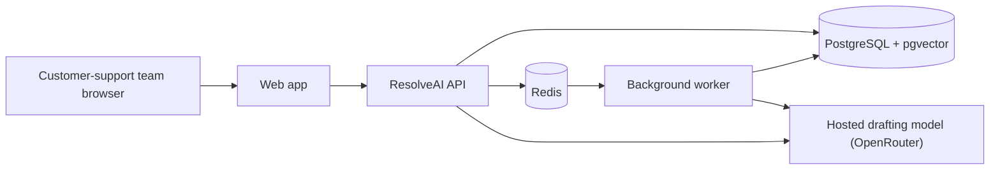

# Deploying ResolveAI

This guide prepares ResolveAI for a real deployment. It does **not** deploy the project automatically: publishing requires a cloud account, a domain, production secrets, and an explicit decision about where customer data may be processed.

## The production shape

The API accepts requests and stores durable data. Redis is a short-lived mailbox for slow evaluation work, and the worker picks that work up separately. PostgreSQL is the system of record, so job results survive a worker restart.

## Model choice for a public deployment

Ollama on your laptop is useful during local development: Docker reaches it at `host.docker.internal`. A public user cannot reach the Ollama process running only on your laptop. A hosted deployment has two sensible options:

1. Use a hosted model provider for draft writing, such as OpenRouter. This is the simplest first deployment; configure `RESOLVEAI_DRAFT_PROVIDER=openrouter` and keep the key in the host's secret manager.
2. Host Ollama and its models on the same server or a dedicated private inference server. This gives more control, but you must operate model storage, capacity, authentication, networking, monitoring, and upgrades.

The project already supports the first option for the draft writer. Triage and grounding review remain local-model features in the current learning build, so a fully public production rollout needs either a hosted/private Ollama service reachable by API and worker, or an intentionally designed hosted equivalent for those agents. Do not expose Ollama directly to the public internet.

## Preflight checklist

- Provision managed PostgreSQL with the `pgvector` extension and managed Redis, or run equivalent private services.
- Give the API and worker the same `RESOLVEAI_DATABASE_URL` and `RESOLVEAI_REDIS_URL`.
- Create separate strong production database credentials. Do not use the development defaults in `.env.example`.
- Set `RESOLVEAI_CORS_ORIGINS` to the exact HTTPS URL of the hosted web app.
- Store `RESOLVEAI_OPENROUTER_API_KEY` in your host's secret manager; never put it in Git or `NEXT_PUBLIC_*` variables.
- Set the web app's `NEXT_PUBLIC_API_BASE_URL` to the public HTTPS API URL at build time.
- Put TLS/HTTPS in front of the API and web app, restrict database and Redis to private networking, and back up PostgreSQL.
- Run database migrations once as a release step before starting API and worker replicas.
- Configure health monitoring for `GET /api/v1/health` and inspect worker logs / durable job states.

## Suggested release order

1. Build the API image, worker image, and web image from the same tested commit.
2. Inject production secrets and URLs through the host's secret/environment configuration.
3. Run Alembic migrations once: `alembic upgrade head` from the API image.
4. Start one or more API instances, then one or more workers, then the web app.
5. Check `/api/v1/health`, create a synthetic lab case, and confirm its durable job changes from `queued` to `completed` or `failed`.
6. Enable logs, backups, alerts, and a rollback path before sending customer traffic.

## What Docker Compose is for

The supplied `docker-compose.yml` is the local integration environment. It proves that the web app, API, Redis, worker, PostgreSQL, migrations, and your local Ollama process work together. In a first cloud deployment, map these roles to managed services or private containers rather than exposing the Compose ports directly to the internet.
