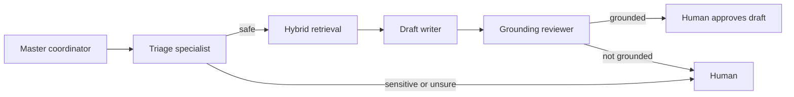

# ResolveAI Guided Demo: Learn the System by Using It

This is the best next step for your AI-engineering learning: do not read every code file first. Run one real, safe workflow, then connect each screen to the architecture behind it.

## Before you start

Open [http://localhost:3000](http://localhost:3000). The app runs in Docker, so keep Docker Desktop open and running.

## 1. Create a workspace

In **Step 1**, create a workspace such as:

- Name: `Shrey Support`
- URL slug: `shrey-support`

The slug is the URL-safe identifier used by the API. ResolveAI now converts capital letters and spaces into the lowercase, hyphenated form automatically.

**What you learned:** a workspace is a tenant boundary. In a future multi-company version, it prevents one company's tickets and knowledge articles from mixing with another's.

## 2. Add a trusted source

In the **Knowledge** area, import a TXT or Markdown document explaining a simple issue, such as SSO sign-in troubleshooting. Review the created draft, then publish it.

**What you learned:** this is the knowledge base behind RAG. The AI is not asked to answer from its general memory. It may use only deliberately published content.

## 3. Create a support ticket

In **Step 2**, create a ticket that asks about the article you just published.

**What you learned:** this is not yet an AI answer. It is an ordinary piece of support data stored in PostgreSQL.

## 4. Watch the master-agent workflow

Click **Assess ticket**, then generate a draft if it is allowed. Read the card/timeline that appears.

The **master coordinator** is the traffic controller. It chooses the order of steps and prevents unsafe jumps. The **subagents** each do one small job:

- Triage decides whether the ticket needs a human immediately.
- Retrieval locates approved sources.
- The writer produces a response only from those sources.
- The reviewer checks whether that response stayed grounded.

**What you learned:** “multi-agent” should mean clear roles and guarded handoffs, not several chatbots talking randomly.

## 5. Demonstrate hybrid search

Use Steps 5–7 with one exact query, such as `SSO`, and one natural-language query, such as `our company cannot log in`.

- **Keyword retrieval** rewards exact terms.
- **Semantic retrieval** uses embeddings to find similar meaning.
- **Hybrid retrieval** combines their rankings with reciprocal-rank fusion (RRF).

**What you learned:** hybrid search is often stronger than vector-only RAG because support issues contain both exact identifiers and paraphrased questions.

## 6. Demonstrate model evaluation safely

In **Step 9**, create a synthetic—not customer—scenario, choose a published source, and run both writers. Then inspect Steps 10 and 11.

This work is handled by a background worker, so the browser does not have to wait for a slow model response. Redis carries the short-lived work message; PostgreSQL keeps the durable job and its results.

Compare models using three kinds of evidence:

- Was the draft grounded in the approved source?
- What score did a human give it?
- How long did it take?

The policy screen makes a recommendation. It does not change customer-facing traffic automatically.

**What you learned:** evaluation is an engineering loop—create a test, measure a result, apply a decision rule—not a one-time prompt comparison.

## 7. Explain the project in an interview

Use this concise description:

> “ResolveAI is a safety-first customer-support copilot. I designed a master coordinator with specialist agents for triage, hybrid retrieval, drafting, and grounding review. It keeps humans in control, measures models in a separate synthetic lab, and uses evidence-based selection rules instead of silently switching models.”

For a longer discussion and deployment architecture, continue with the [portfolio walkthrough](portfolio-walkthrough.md) and [deployment guide](deployment-guide.md).
