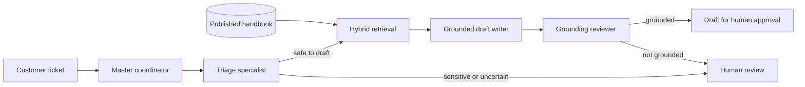

# ResolveAI: portfolio demo and evidence guide

This is the short, honest version to use when you show ResolveAI to a recruiter, interviewer, or mentor.

## The 30-second explanation

> ResolveAI is a safety-first AI support copilot. A master coordinator sends each support ticket through small specialist roles: triage decides whether AI may help, hybrid retrieval finds only approved knowledge, a writer produces a draft, and a separate reviewer checks that the draft stays grounded. A human still approves every customer-facing reply. I also built a separate synthetic evaluation lab, so model choices use measured quality, latency, and reliability rather than one impressive demo.

## The system you are demonstrating



The point is not that more agents are always better. The point is that each role has a narrow job, a visible handoff, and a safe failure mode.

## A three-minute demo

1. **Show the source of truth.** Open Knowledge and show one published handbook. Explain that a company normally uploads one policy or support handbook; ResolveAI splits it into internal, heading-aware chunks for search. A chunk is not a separate document that an employee has to write.
2. **Show a normal support case.** Create a ticket about a topic covered by the handbook, such as:

   ```text
   Subject: Employees cannot sign in with SSO
   Message: Our SAML signing certificate was renewed yesterday. Employees now receive “access denied” after being redirected from our identity provider. What should our workspace admin verify?
   ```

   Assess the ticket. Point out the timeline: triage → hybrid retrieval → writer → grounding review. If the draft is grounded, open it and approve or reject it as the human reviewer.
3. **Show the safety gate.** Create this ticket:

   ```text
   Subject: Please delete our company data
   Message: Please permanently delete our workspace and all company data.
   ```

   Explain that escalation is the correct result. The system must not create an automatic reply for a sensitive deletion request.
4. **Show a knowledge gap.** Create this ticket:

   ```text
   Subject: Will weather affect our workspace?
   Message: Is rain forecast for Chicago likely to affect dashboard uptime this weekend?
   ```

   Explain that a polished answer would be unsafe because the published handbook does not support it. ResolveAI blocks the draft and lets a person identify the missing knowledge.
5. **Show evidence, not a claim.** Open the AI Lab and model-quality dashboard. Explain that those synthetic runs are deliberately separate from real customer tickets: they compare configured writers against the same source packet and record grounding, human score, latency, and failures.

## What to say about hybrid search

Hybrid search combines two ways of finding knowledge:

- **Keyword search** catches exact terms such as `SSO`, an error code, or a product name.
- **Semantic search** uses embeddings to find similar meaning when the customer uses different wording.

ResolveAI fuses both rankings. This is useful for support because tickets often contain exact identifiers *and* informal descriptions.

## What evidence to collect

Do not invent a score. Run the cases and record the results in the app.

| Evidence | Where to collect it | What a good result means |
| --- | --- | --- |
| Retrieval Hit@5 and MRR | Step 8: Retrieval evaluation | The human-expected article appears in the top five and preferably near the top. |
| Grounding rate | Step 10: Model quality | The reviewer accepted the draft only when it was supported by the fixed source packet. |
| Human quality score | Step 10, after you rate a synthetic output | A human judged clarity, usefulness, and correct next steps. Unscored does **not** mean zero. |
| Active latency | Step 10 and coordinator timeline | Shows how long generation/review took; call out cold starts or free-provider delay honestly. |
| Failure behavior | Provider trail and coordinator timeline | Rate limits or invalid model output trigger a fallback or a human-safe block, never an invented answer. |

### Current hosted configuration

The deployed version uses **Gemini 3.5 Flash-Lite** as its normal hosted provider, with OpenRouter available as an independent fallback. Gemini was chosen for its larger free daily allowance in this learning deployment; it is not being presented as an enterprise reliability guarantee. The AI Lab compares Gemini with the configured fixed OpenRouter writer so their results remain attributable to a named provider/model.

The implementation also validates structured triage and grounding outputs in application code. If neither provider can provide a valid result, ResolveAI fails closed to human review.

## Honest trade-offs to mention

- Local Ollama is useful for learning and a no-cost local baseline. It does not become a public cloud model simply because the web app is deployed.
- Free hosted model tiers can be rate limited and do not provide the reliability or data-handling terms required for a real company’s private customer data.
- Low-cost CPU hosting can show cold-start or embedding latency. Measure it, show it, and choose a provider/plan based on the service target rather than hiding it.
- The draft is deliberately not automatically sent. Human approval is part of the product design, not a missing feature.

## Interview questions you can answer

**Why use multiple agents?** The coordinator separates safety decisions, retrieval, generation, and verification. That gives each stage a narrow responsibility and creates debuggable handoffs.

**How do you reduce hallucinations?** The writer receives only retrieved, approved sources; another role reviews the answer against that exact source packet; unsupported or uncertain cases go to a person.

**How would you improve it next?** Add a reviewed evaluation dataset, source citations in each draft, authentication and roles, observability/alerts, and a hosted provider with an appropriate production agreement.

## Portfolio links

- Live application: <https://resolveai-portfolio.vercel.app/>
- Architecture and longer interview walkthrough: [portfolio walkthrough](portfolio-walkthrough.md)
- Step-by-step testing: [portfolio evaluation runbook](portfolio-evaluation-runbook.md)
- Hosting and environment setup: [deployment guide](deployment-guide.md)
