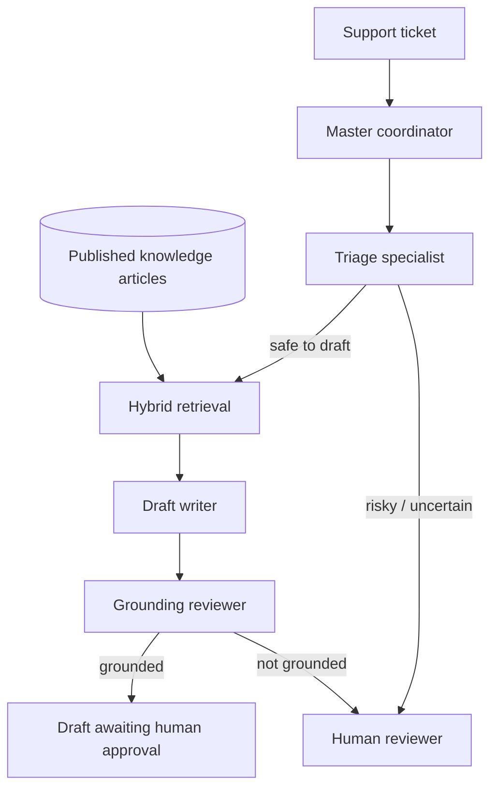

# ResolveAI Portfolio Walkthrough

ResolveAI is a safety-first AI customer-support copilot. It demonstrates the practical parts of AI engineering: retrieval, agent orchestration, evaluation, human review, background work, and a deployable service design.

## The one-minute explanation

> “I built ResolveAI to help a support team draft answers from approved knowledge articles. A master coordinator uses specialist agents for triage, hybrid retrieval, drafting, and grounding review. The system fails closed: risky tickets and ungrounded drafts go to a human instead of being sent. I also built a separate synthetic evaluation lab so model choices use evidence—grounding, human scores, and latency—rather than intuition.”

## Architecture

### Why this is multi-agent design

The master coordinator owns the order and safety gates. It does not ask every agent to do everything. Each specialist has one narrow responsibility:

- **Triage specialist:** decides whether drafting is safe to attempt.
- **Retrieval specialist:** finds approved source articles with hybrid search.
- **Draft writer:** writes only from the chosen source packet.
- **Grounding reviewer:** checks the draft against those exact sources.

That separation gives you clearer failures and a useful operational timeline. A single general chatbot could answer faster, but it would be harder to evaluate and control.

### Why hybrid search matters

Hybrid search combines two different retrieval signals:

- Keyword search catches exact terms such as an error code, product name, or `SSO`.
- Semantic search uses embeddings to catch similar meaning even when the phrasing differs.

ResolveAI fuses the two rankings. This is often more reliable than using only vector/RAG search because support questions contain both precise identifiers and natural language paraphrases.

## Demo script

1. Open the deployed application at <https://resolveai-portfolio.vercel.app/> (or `http://localhost:3000` when running locally) and select the support workspace.
2. Create or view a published knowledge article, then create a ticket that matches it.
3. Run triage and generate a draft. Point out the timeline: triage → hybrid retrieval → writer → grounding review.
4. Explain that the reply is only a draft. A person must approve it before the ticket is resolved.
5. In the synthetic evaluation lab, run the same source-backed scenario against the two configured writers. Local Docker compares Ollama and OpenRouter; the hosted deployment compares Gemini 3.5 Flash-Lite with the configured fixed OpenRouter writer. Point out the provider trail, grounding outcome, and latency instead of claiming that either model is always better.
6. Score the outputs, inspect the separate grounding and zero-latency draft-quality checks, then set a model-selection policy. Explain that it recommends—not automatically changes—the model.
7. Create a named experiment to show how evidence can be reproduced later.

## Evidence and safety controls

| Concern | ResolveAI design choice |
| --- | --- |
| Hallucinated answer | Draft writer receives only approved retrieved sources; a separate reviewer checks grounding. |
| Sensitive support request | Triage escalates refunds, deletion, credential, security, and privacy requests. |
| Slow model call | Durable job state in PostgreSQL; a worker handles it outside the web request. |
| Model comparison | Synthetic, isolated lab cases with per-model latency, grounding result, and human score. |
| Hosted free-model failure | Safe provider-attempt trail records the model, outcome, and HTTP status; it never records keys or prompts. |
| Readable but poor draft | A deterministic quality check catches copied ticket text, unreadable output, and a missing next step without another model call. |
| Unsafe automation | Drafts need human approval; selection policy only makes recommendations. |
| Lost debugging context | Safe timeline records stages, models, source IDs, and timings—not private reasoning. |

## Good interview follow-ups

- **“How would you improve retrieval?”** Add more labelled cases, compare fusion weights, track Hit@k/MRR, and inspect retrieval misses before changing the model.
- **“How would you deploy it?”** Put web/API/worker behind HTTPS, use private PostgreSQL and Redis, run migrations as a release step, store provider keys in a secret manager, and use a hosted/private model service rather than laptop Ollama.
- **“What would you build next?”** Authentication/roles, source citations in the UI, audit retention policies, an evaluation dataset review workflow, and observability/alerts.

## What you personally learned here

This project is not only a chatbot. It is a small AI system with data flow, decisions, safety gates, asynchronous processing, model-provider trade-offs, and evaluation evidence. Those are the building blocks you will repeatedly use as an AI engineer or solutions architect.
